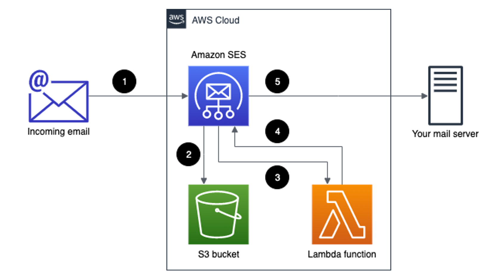

# terraform-aws-mcaf-ses-forwarder

Terraform module to configure a SES forwarder.

Loosely based on the [Forward Incoming Email to an External Destination blog post](https://aws.amazon.com/blogs/messaging-and-targeting/forward-incoming-email-to-an-external-destination/) in combination with the [aws-lambda-ses-forwarder by @arithmetric](https://github.com/arithmetric/aws-lambda-ses-forwarder), this Terraform module creates the necessary resources to accept mail sent to a verified email address and forward it to an external recipient or recipients.

## How it works

This solution uses several AWS services to forward incoming emails to one or more external email addresses. The following diagram shows the flow of information in this solution:



1. A new email is sent from an external sender to your domain. Amazon SES handles the incoming email for your domain.
2. An Amazon SES receipt rule saves the incoming message in an S3 bucket.
3. An Amazon SES receipt rule triggers the execution of a Lambda function.
4. The Lambda function retrieves the message content from S3, and then creates a new message and sends it to Amazon SES.
5. Amazon SES sends the message to the destination server.

To gain a more indepth understanding of this setup it's recommended to give both links mentioned above a read through.

## Example usage

In combination with the [terraform-aws-mcaf-ses](https://github.com/schubergphilis/terraform-aws-mcaf-ses) module to configure SES, the following creates the S3 bucket, lambda and SES rule set to accept mail sent to `hello@app.dev` and forward it to `user1@company.io` and `user2@company.io`:

```terraform
provider "aws" {
  alias = "lambda"
}

provider "aws" {
  alias = "route53"
}

module "ses" {
  providers = { aws = aws, aws.route53 = aws.route53 }

  source = "github.com/schubergphilis/terraform-aws-mcaf-ses"
  domain = "app.dev"
  tags   = {}
}

module "ses-forwarder" {
  providers = { aws = aws, aws.lambda = aws.lambda }

  source      = "github.com/schubergphilis/terraform-aws-mcaf-ses-forwarder"
  bucket_name = "app-dev-ses-forwarder"
  from_email  = "ses@app.dev"
  tags        = {}

  recipient_mapping = {
    "hello@app.dev" = ["user1@company.io", "user2@company.io"]
  }
}
```

<!--- BEGIN_TF_DOCS --->
## Requirements

| Name | Version |
|------|---------|
| <a name="requirement_terraform"></a> [terraform](#requirement\_terraform) | >= 1.0 |
| <a name="requirement_aws"></a> [aws](#requirement\_aws) | >= 4.9.0 |

## Providers

| Name | Version |
|------|---------|
| <a name="provider_archive"></a> [archive](#provider\_archive) | n/a |
| <a name="provider_aws"></a> [aws](#provider\_aws) | >= 4.9.0 |
| <a name="provider_template"></a> [template](#provider\_template) | n/a |

## Modules

| Name | Source | Version |
|------|--------|---------|
| <a name="module_lambda"></a> [lambda](#module\_lambda) | github.com/schubergphilis/terraform-aws-mcaf-lambda | v0.3.3 |
| <a name="module_s3_bucket"></a> [s3\_bucket](#module\_s3\_bucket) | github.com/schubergphilis/terraform-aws-mcaf-s3 | v0.6.1 |

## Resources

| Name | Type |
|------|------|
| [aws_lambda_permission.allow_ses](https://registry.terraform.io/providers/hashicorp/aws/latest/docs/resources/lambda_permission) | resource |
| [aws_ses_active_receipt_rule_set.default](https://registry.terraform.io/providers/hashicorp/aws/latest/docs/resources/ses_active_receipt_rule_set) | resource |
| [aws_ses_receipt_rule.default](https://registry.terraform.io/providers/hashicorp/aws/latest/docs/resources/ses_receipt_rule) | resource |
| [aws_ses_receipt_rule_set.default](https://registry.terraform.io/providers/hashicorp/aws/latest/docs/resources/ses_receipt_rule_set) | resource |
| [archive_file.lambda](https://registry.terraform.io/providers/hashicorp/archive/latest/docs/data-sources/file) | data source |
| [aws_caller_identity.current](https://registry.terraform.io/providers/hashicorp/aws/latest/docs/data-sources/caller_identity) | data source |
| [aws_iam_policy_document.lambda_policy](https://registry.terraform.io/providers/hashicorp/aws/latest/docs/data-sources/iam_policy_document) | data source |
| [aws_iam_policy_document.logs_bucket](https://registry.terraform.io/providers/hashicorp/aws/latest/docs/data-sources/iam_policy_document) | data source |
| [aws_region.current](https://registry.terraform.io/providers/hashicorp/aws/latest/docs/data-sources/region) | data source |
| [template_file.index_json](https://registry.terraform.io/providers/hashicorp/template/latest/docs/data-sources/file) | data source |

## Inputs

| Name | Description | Type | Default | Required |
|------|-------------|------|---------|:--------:|
| <a name="input_bucket_name"></a> [bucket\_name](#input\_bucket\_name) | S3 bucket name where SES stores emails | `string` | n/a | yes |
| <a name="input_from_email"></a> [from\_email](#input\_from\_email) | Forwarded emails will come from this verified address | `string` | n/a | yes |
| <a name="input_recipient_mapping"></a> [recipient\_mapping](#input\_recipient\_mapping) | Map of recipients and the addresses to forward on to | `map(any)` | n/a | yes |
| <a name="input_tags"></a> [tags](#input\_tags) | Map of tags to set on Terraform created resources | `map(string)` | n/a | yes |
| <a name="input_allow_plus_sign"></a> [allow\_plus\_sign](#input\_allow\_plus\_sign) | Enables support for plus sign suffixes on email addresses | `bool` | `true` | no |
| <a name="input_bucket_lifecycle_rules"></a> [bucket\_lifecycle\_rules](#input\_bucket\_lifecycle\_rules) | S3 bucket lifecycle rules | `list(any)` | <pre>[<br>  {<br>    "enabled": true,<br>    "expiration": {<br>      "days": 14<br>    },<br>    "id": "two-week-retention"<br>  }<br>]</pre> | no |
| <a name="input_bucket_prefix"></a> [bucket\_prefix](#input\_bucket\_prefix) | S3 key name prefix where SES stores email | `string` | `"inbound-mail"` | no |
| <a name="input_kms_key_arn"></a> [kms\_key\_arn](#input\_kms\_key\_arn) | KMS key ARN used for encryption | `string` | `null` | no |
| <a name="input_lambda_name"></a> [lambda\_name](#input\_lambda\_name) | The name of the Lambda function | `string` | `"EmailForwarder"` | no |
| <a name="input_ses_rule_name"></a> [ses\_rule\_name](#input\_ses\_rule\_name) | The name of the SES rule that invokes the Lambda function | `string` | `"EmailForwarder"` | no |
| <a name="input_ses_rule_set_name"></a> [ses\_rule\_set\_name](#input\_ses\_rule\_set\_name) | The name of the active Rule Set in SES which you have already configured | `string` | `"EmailForwarder"` | no |
| <a name="input_subject_prefix"></a> [subject\_prefix](#input\_subject\_prefix) | String to prepend to the subject of forwarded mail | `string` | `""` | no |

## Outputs

No outputs.

<!--- END_TF_DOCS --->
